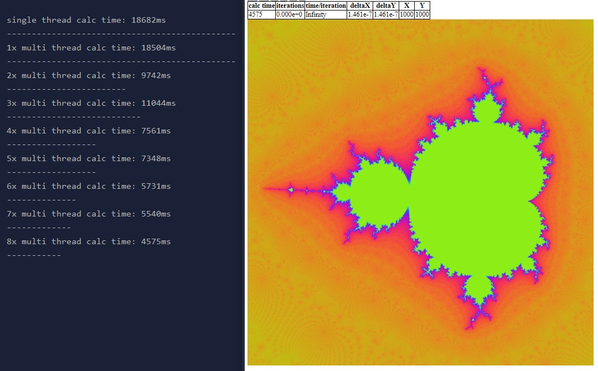
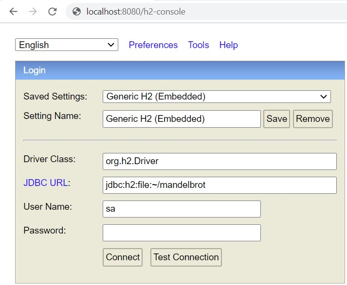
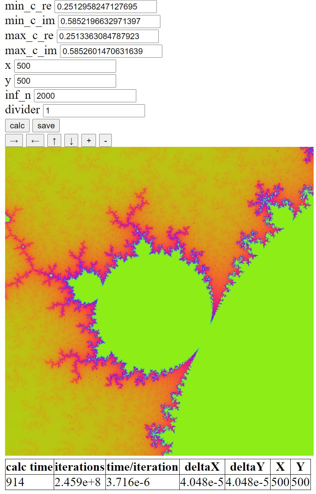

# MandelbrotSpring
Web application, visualisation of the Mandelbrot set  
Fractal calulations on server side. Image generated on client side. Tons of fun
 
 
 
##To run the application:
1. clone project
2. set up maven in IDE

3. **(only if you wish to save calculation result to database)**  
Go into h2 console and make sql-statement:
"ALTER TABLE CALC_RESULT ALTER COLUMN RESULT_DATA BLOB" then press RUN   
   

4. Go to http://localhost:8080/ and have some fun 

---

